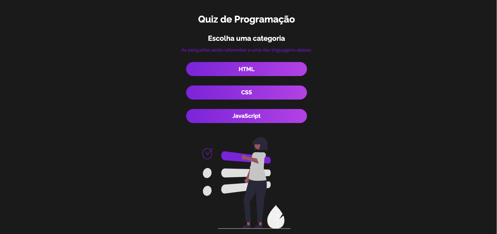
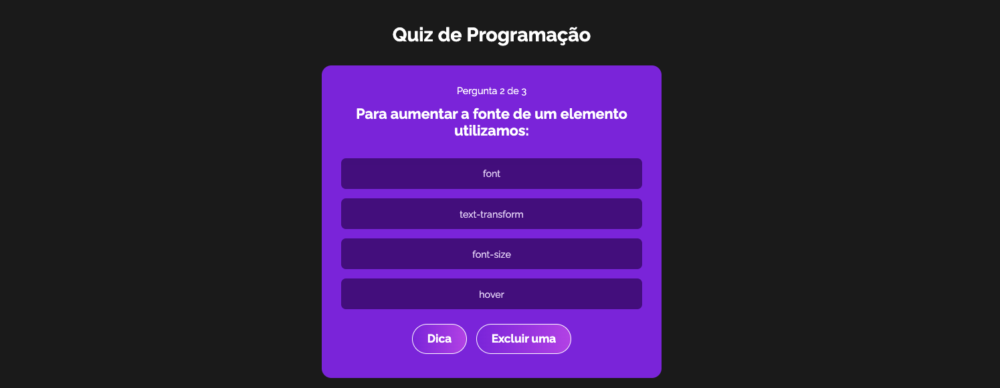
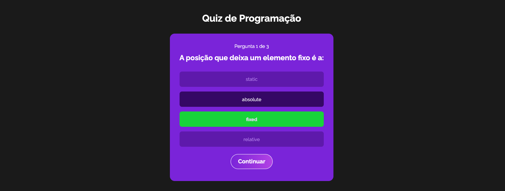

🎯 Quiz App em React

Um aplicativo de Quiz desenvolvido em **React.js**, com gerenciamento de estado global usando Context API e **useReducer.  
O usuário pode escolher uma categoria, responder perguntas, receber dicas e verificar sua pontuação no final.

 🚀 Tecnologias utilizadas

- Context API + useReducer  
- CSS Modules (estilização)  
- JavaScript ES6+  

🎮 Funcionalidades

✅ Escolha de categoria (HTML, CSS, JavaScript)  
✅ Embaralhamento das perguntas  
✅ Sistema de pontuação  
✅ Dicas para algumas perguntas  
✅ Eliminação de alternativas incorretas  
✅ Tela de **Game Over** com reinício  

Telas do Quiz

